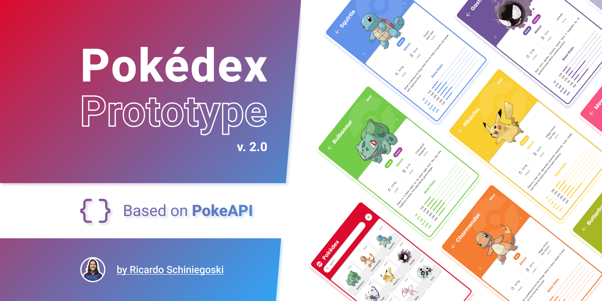

<h1 align="center">
  
</h1>

---

## Layout

Layout used for development, you can access it in [FIGMA](<https://www.figma.com/file/oyy40kpPCamOuJOQu1uYMo/Pok%C3%A9dex-(Community)?type=design&node-id=0-1&t=DWOWUmDb3a8TNSUI-0>)

---

## Functionalities

<p>

- Home Page:
  - List of pokémon with their names and numbers
  - Pokemon search by name and number
  - sort by name and number
- Pokemon Detail Page:
  - Listing of pokemon information containing the following data:
  - Name
  - Number
  - Image
  - Weight
  - Height
  - Movements
  - Short Description
  - Base Status
  </p>

## Developing

---

### Built With

    - Flutter
    - Mobx(state management)
    - get_it(dependency injection)
    - dio(Http request)
    - google fonts

### Prerequisites

First, correctly configure the Flutter development environment on your machine, for that, access the link below [Flutter Install](<https://www.figma.com/file/oyy40kpPCamOuJOQu1uYMo/Pok%C3%A9dex-(Community)?type=design&node-id=0-1&t=DWOWUmDb3a8TNSUI-0>)

### Setting up Dev

```shell
git clone https://github.com/Guysanches/pokedex_app
cd pokedex_app
flutter pub get
flutter run
```
